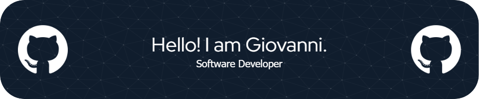

# 💪 About Me:

My name is Giovanni, I am a software developer. I love new challenges and I am eager to get involved in something new and learn. I always share my passion and knowledge with people around me.

 

# 💻 Languages and Tools:

  

 

# 🌐 Socials:

